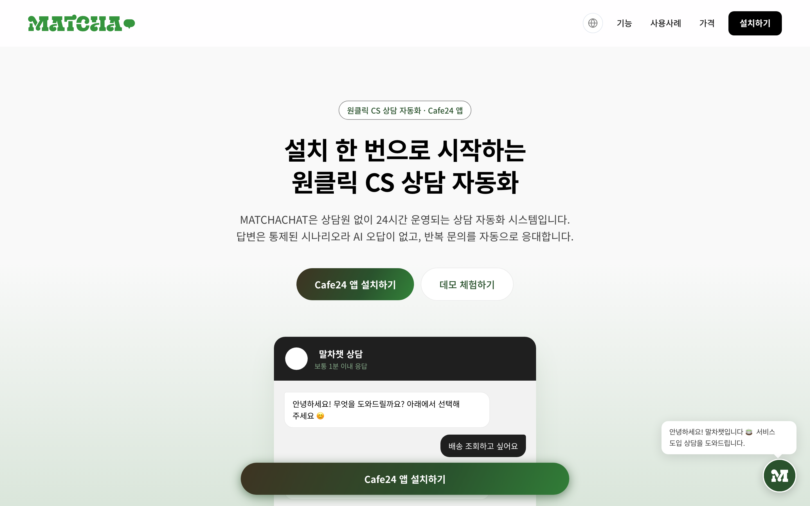
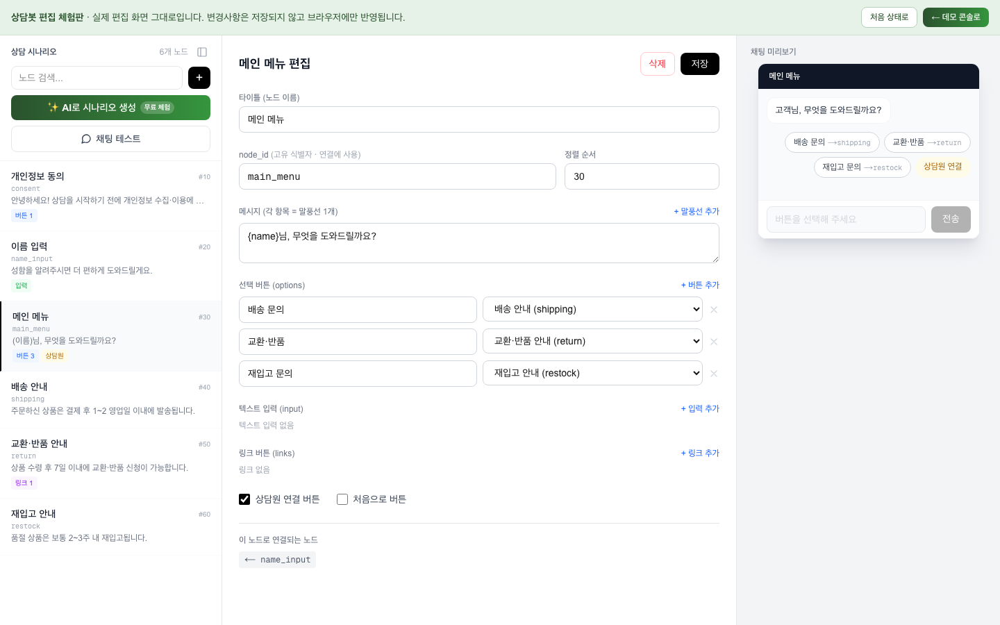
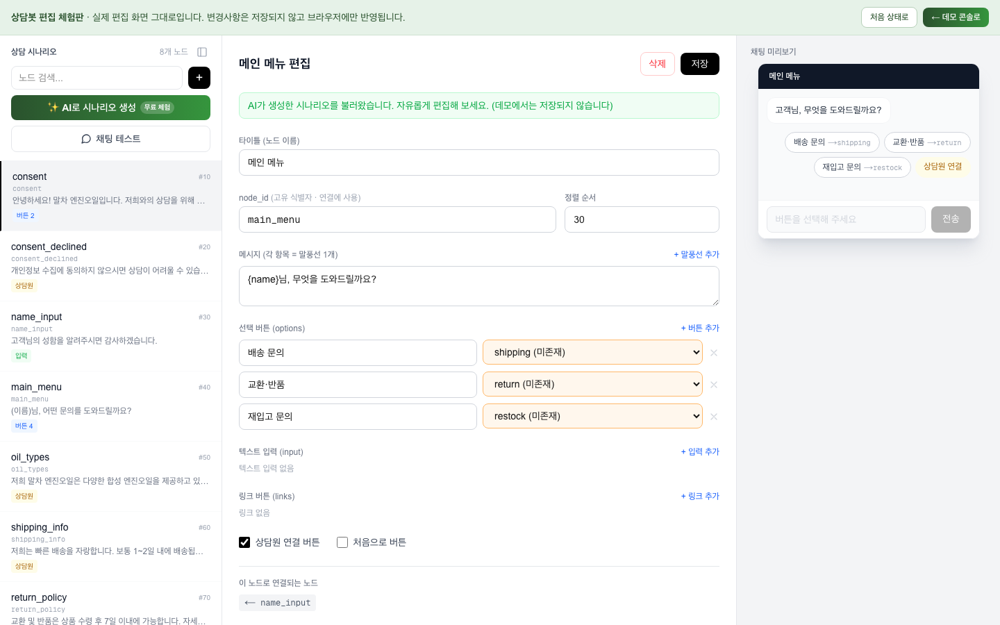
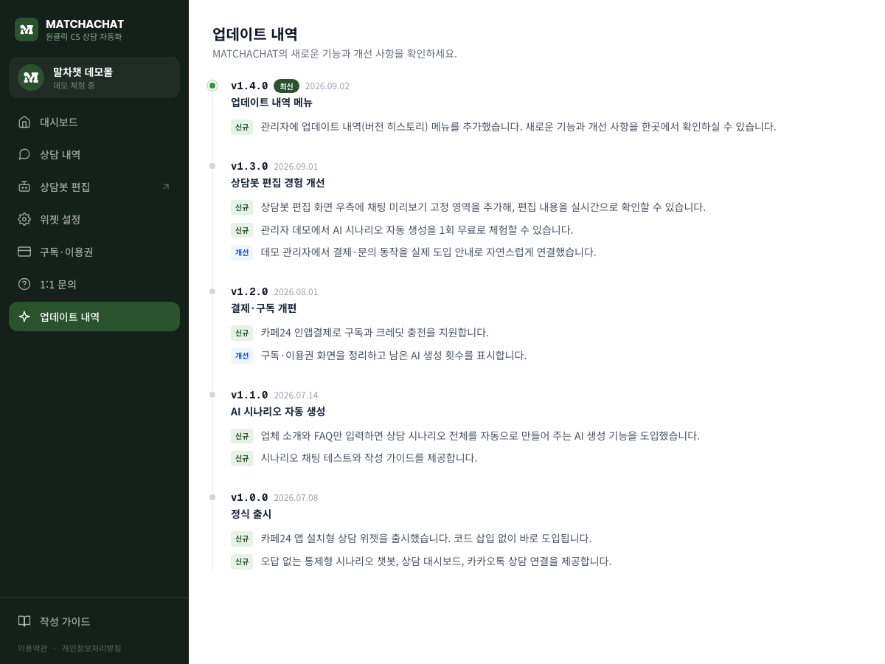
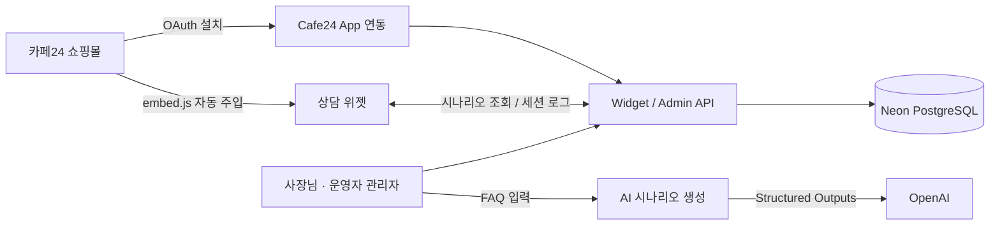

# MATCHACHAT

> FAQ만 붙여넣으면 AI가 상담봇을 만들어 주는, 카페24 쇼핑몰용 상담 자동화 SaaS

멀티테넌트 채팅 위젯 SaaS입니다. 쇼핑몰 사장님이 카페24 앱스토어에서 설치하면, 코드 삽입 없이 자사몰에 상담 위젯이 붙고, 업체 FAQ만 입력하면 AI가 상담 시나리오 전체를 자동으로 생성합니다. 답변은 통제된 시나리오라 AI 오답이 없고, 반복 문의를 24시간 무인으로 응대합니다.

 

## 이 프로젝트가 푸는 문제

소규모 쇼핑몰은 상담 인력이 부족한데 문의의 상당수는 배송 / 교환·반품 / 재고 / 제품 사용법처럼 반복됩니다. 기존 상담 솔루션은 셋업이 번거롭거나, AI 상담은 오답 리스크가 있습니다.

MATCHACHAT은 이 둘을 분리했습니다. **셋업은 AI로 자동화**하고, **답변은 통제된 시나리오로 고정**합니다. 어려운 상담만 카카오톡으로 자연스럽게 연결합니다.

 

## 핵심 기능

- **AI 시나리오 자동 생성** - 업체 소개와 FAQ를 입력하면 동의 / 이름 / 메인메뉴부터 주제별 답변까지 상담 그래프 전체를 생성 (OpenAI Structured Outputs로 스키마 강제)
- **오답 없는 통제형 응대** - 설계된 시나리오 노드대로만 응답, LLM 환각 없음
- **노코드 설치** - 카페24 OAuth 설치 시 ScriptTag 자동 주입, 코드 삽입 불필요
- **비주얼 시나리오 편집기** - 노드 그래프 편집 + 실시간 채팅 미리보기 + 대화 흐름 테스터
- **멀티테넌트 관리자** - 몰 사장님 콘솔과 운영자 통합 콘솔 분리, 상담 대시보드
- **카페24 인앱결제** - 구독 / 크레딧 기반 과금
- **카카오톡 핸드오프** - 봇이 못 푸는 상담은 기존 카카오 채널로 연결

 

## 스크린샷

| 시나리오 편집기 (실시간 미리보기) | AI 시나리오 생성 |
| :---: | :---: |
|  |  |

| 업데이트 내역 | |
| :---: | :---: |
|  | |

 

## 아키텍처

- **위젯**: 스크립트 한 줄(`embed.js`)로 어떤 몰에도 임베드, 테넌트별 브랜딩 / 위치 커스터마이징
- **테넌트 격리**: 모든 데이터는 `client_id` 스코프 + 서버측 접근 제어 이중 방어
- **결제 대사**: 카페24 인앱결제 주문을 폴링 / 대사해 구독 상태와 크레딧 동기화

 

## 기술 스택

| 영역 | 사용 기술 |
| --- | --- |
| 프레임워크 | Next.js 16 (App Router), React 19, TypeScript |
| 스타일 | Tailwind CSS v4 |
| 데이터베이스 | Neon PostgreSQL (serverless) |
| AI | OpenAI (Structured Outputs, json_schema strict) |
| 인증 | JWT (jose), bcrypt, 계정별 TOTP 2FA (otpauth) |
| 연동 | 카페24 OAuth / ScriptTag / 인앱결제 API |
| 배포 | Vercel (리전 co-location) |

 

## 보안 설계

포트폴리오 관점에서 특히 공들인 부분입니다.

- **테넌트 격리** - 전 API가 `client_id` 스코프 + `WHERE client_id` 이중 검증으로 IDOR 차단
- **카페24 앱 실행 검증** - HMAC-SHA256 서명 검증 + 2시간 replay 방지
- **OAuth 하드닝** - state 서명키를 관리자 JWT와 분리, nonce 1회용 소비로 replay 거부
- **토큰 회전 대응** - 카페24 refresh 시 회전되는 토큰을 즉시 저장, 동시 갱신 경합 복구
- **크레딧 TOCTOU 방지** - AI 생성 크레딧을 호출 전에 원자적으로 선점, 실패 시 환불
- **2FA** - 계정별 TOTP 시드, 비밀번호 변경 시 기존 세션 무효화
- **업로드 / 입력 방어** - 이미지 MIME 화이트리스트, 쓰기 요청 Origin 검증

 

## 프로젝트 정보

- **유형**: 1인 개발 SaaS (기획 · 디자인 · 풀스택 · 배포 · 운영)
- **상태**: 프로덕션 운영 중 ([matchachat.co.kr](https://matchachat.co.kr))
- **체험**: 로그인 없이 [관리자 데모](https://matchachat.co.kr/admin/demo)에서 전체 콘솔 + AI 생성 1회 무료 체험

 

## 고지

이 저장소는 **제품 소개용 쇼케이스(포트폴리오)**입니다. 서비스 소스 코드는 비공개이며, 본 저장소에는 문서와 스크린샷만 포함됩니다. 무단 복제 / 재사용을 허용하지 않습니다.

문의: [contact@matchachat.co.kr](mailto:contact@matchachat.co.kr)
